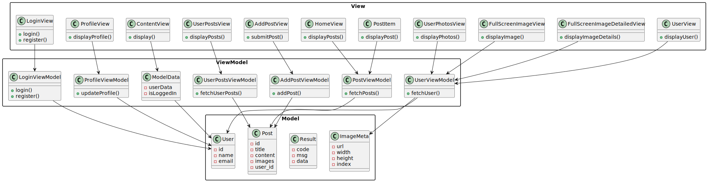

# PhotonTrail 技术报告

## 1. 产品功能介绍

PhotonTrail 是一个专注于摄影作品分享与互动交流社区的 iOS 客户端，主要功能包括：

- **用户注册与登录**：用户可以通过电子邮件注册新账户或登录已有账户。
- **个人资料编辑**：用户可以编辑个人资料，包括头像、背景图片、昵称和个人简介。
- **发布帖子**：用户可以发布包含多张图片的帖子，并添加标题、描述、相机和镜头信息。
- **查看用户主页**：用户可以查看自己的帖子和照片，也可以浏览其他用户的帖子和照片。
- **支持全屏查看图片**：用户可以全屏查看帖子中的图片，并支持切换图片、缩放和拖动操作。

## 2. 程序概要设计

PhotonTrail 采用 MVVM 架构，主要分为以下几个模块：

- **Model**：定义数据结构和业务逻辑，包括用户信息、帖子信息等。
- **ViewModel**：处理数据的获取和处理逻辑，并将数据提供给视图层。
- **View**：负责界面的展示和用户交互。

主要文件和功能：
- `ModelData.swift`：管理用户数据和登录状态。
- `LoginViewModel.swift`：处理用户登录和注册逻辑。
- `PostViewModel.swift`：处理帖子数据的获取和展示逻辑。
- `ProfileViewModel.swift`：处理用户资料的更新逻辑。
- `AddPostViewModel.swift`：处理发布帖子的逻辑。
- `ContentView.swift`：应用的主界面，包含自定义的 TabView 和登录视图。
- `HomeView.swift`：展示帖子列表。
- `AddPostView.swift`：发布帖子界面。
- `UserView.swift`：用户主页界面。
- `MineView.swift`：用户个人主页界面。
- `ProfileView.swift`：用户资料编辑界面。

## 3. 软件架构图

## 4. 技术亮点及其实现原理

- **MVVM 架构**：通过将数据和业务逻辑与视图分离，提升代码的可维护性和可测试性。ViewModel 负责处理数据的获取和处理逻辑，并将数据提供给视图层。
- **SwiftUI**：使用 SwiftUI 构建用户界面，简化了界面开发和状态管理。SwiftUI 提供了声明式的语法，使得界面代码更加简洁和易读。
- **网络请求**：使用 Alamofire 处理网络请求，简化了与后端 API 的交互，可以方便地进行 GET、POST 等 HTTP 请求，并处理响应数据。
- **用户登录状态管理**：使用 CoreData 存储登录信息，并在应用启动时进行校验。通过 `ModelData` 类管理用户的登录状态和数据缓存，确保用户数据的持久化和安全性。
- **分页加载**：在 `HomeView` 中展示帖子列表，通过 `PostViewModel` 获取帖子数据，并在视图中展示。支持下拉刷新和分页加载。
- **图片异步加载和缓存**：使用 Nuke 进行图片的异步加载和缓存，提升了图片加载的性能和用户体验。Nuke 提供了高效的图片加载和缓存机制，支持多种图片格式和源。
- **图片上传**：通过 `AddPostViewModel` 和 `ProfileViewModel` 实现图片的上传功能，并使用 STS Token 确保上传的安全性和有效性。
- **全屏图片查看器**：自己实现了一个全屏图片查看器，支持图片的缩放和拖动操作，提升了用户查看图片的体验。通过 `FullScreenImageView` 和 `FullScreenImageDetailedView` 实现图片的全屏查看和缩放功能。

## 6. 后端服务

[PhotonTrail-backend](https://github.com/kkkstra/PhotonTrail-backend) 为 PhotonTrail 实现了后端服务，提供用户注册、登录、帖子管理等功能，以及获取 OSS 上传的 STS Token。